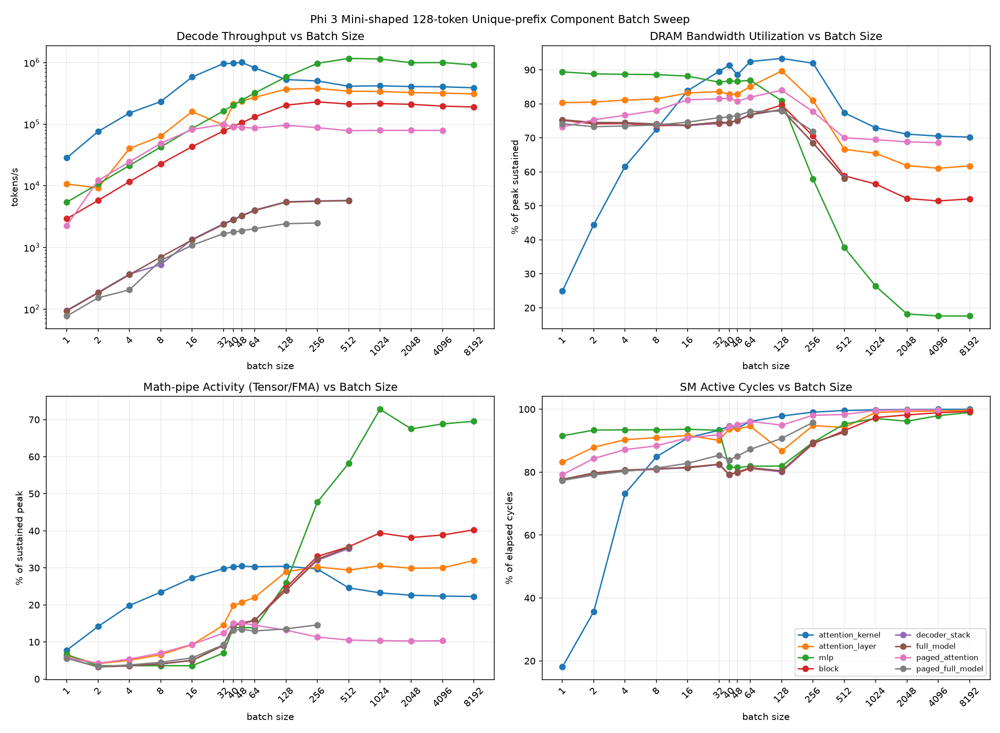
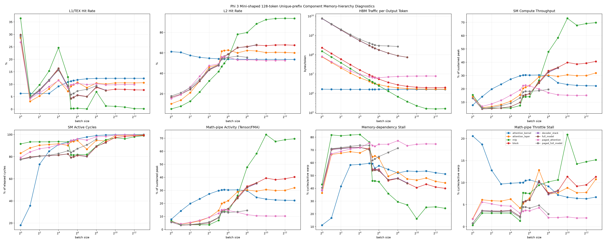
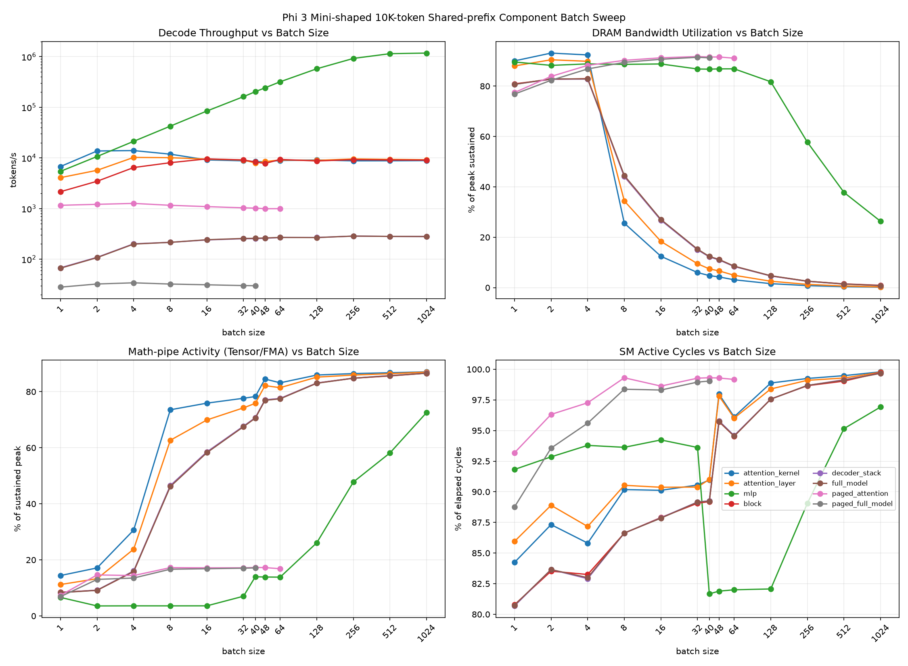
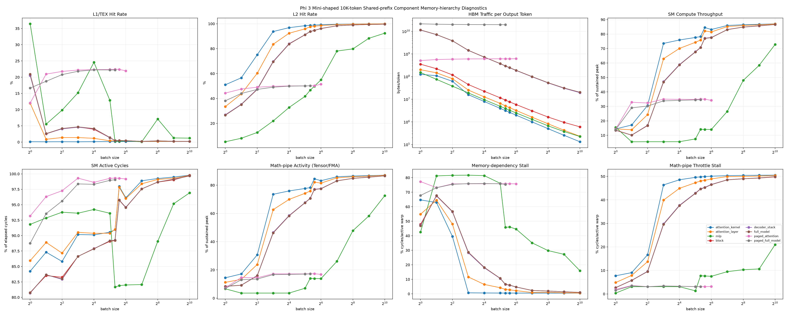

# Component Batch Saturation: Shared and Unique Prefixes

## Methodology

- Hardware: NVIDIA RTX 6000 Ada Generation (48 GB).
- Model shape: Phi-3-mini-shaped synthetic decode ladder in FP16.
- Long shared-prefix workload: one physically shared 10,000-token K/V prefix expanded across the batch.
- Short unique-prefix workload: a distinct 128-token K/V prefix for every request. Paged stages use
  disjoint physical block ranges for every request as well.
- Throughput: 64 measured decode iterations after five warmup iterations, with CUDA synchronization
  around each stage.
- Long-workload batches: `1, 2, 4, 8, 16, 32, 40, 48, 64, 128, 256, 512, 1024`.
- Short-workload batches: the same series plus `2048, 4096, 8192`, subject to each stage's memory limit.
- Nsight Compute: one measured decode iteration after two warmup iterations, using kernel replay and
  the `gpu_memory:components:<stage>:iter` NVTX filter.
- Saturation batch: the first measured batch reaching at least 95% of that stage's maximum observed
  throughput.

The profiler pass measures DRAM throughput, DRAM read/write sectors, L1/TEX and L2 hit rates, L2
hit/miss sectors, SM compute throughput, active SM cycles, achieved occupancy, instruction issue,
tensor/FMA pipe activity, and warp-stall reasons. Percentages shown for a whole component are
kernel-duration-weighted means.

The main sweep figures show both **math-pipe activity**, computed per kernel as the larger of
Tensor-pipe and FMA-pipe activity, and **SM active cycles**. This separates arithmetic-pipeline use
from the fraction of elapsed cycles in which the SMs were doing any work. The broader NCU composite
`sm__throughput.avg.pct_of_peak_sustained_elapsed` is retained separately in the diagnostics as
**composite SM throughput**.

There is no literal “HBM miss” cache event: an L2 miss that is satisfied from device memory produces
DRAM sectors. The study therefore uses L2 misses together with measured DRAM sectors/bytes to track
traffic reaching HBM.

## Component Parameter Counts

The counts below exclude K/V caches and temporary activations. All projections are bias-free and
storage assumes FP16.

| stage            | included modules                              |             parameters | FP16 parameter storage |
| ---------------- | --------------------------------------------- | ---------------------: | ---------------------: |
| attention_kernel | direct SDPA only                              |                      0 |                    0 B |
| attention_layer  | Q, K, V, and output projections               |    37,748,736 (37.75M) |              72.00 MiB |
| mlp              | gate, up, and down projections                |    75,497,472 (75.50M) |             144.00 MiB |
| block            | attention + MLP + two RMSNorms                |  113,252,352 (113.25M) |             216.01 MiB |
| decoder_stack    | 32 decoder blocks                             | 3,624,075,264 (3.624B) |               6.75 GiB |
| full_model       | embeddings + 32 blocks + final norm + LM head | 3,821,079,552 (3.821B) |               7.12 GiB |
| paged_attention  | attention layer with paged K/V runtime state  |    37,748,736 (37.75M) |              72.00 MiB |
| paged_full_model | full model with paged K/V runtime state       | 3,821,079,552 (3.821B) |               7.12 GiB |

## 128-token Unique-prefix Results

| stage            | saturation batch | peak batch | peak throughput (tok/s) | DRAM at peak | math pipe at peak | L2 hit at peak | largest batch | endpoint throughput (tok/s) | endpoint DRAM |
| ---------------- | ---------------: | ---------: | ----------------------: | -----------: | ----------------: | -------------: | ------------: | --------------------------: | ------------: |
| attention_kernel |               32 |         48 |            1,005,914.66 |       88.59% |            30.45% |         53.94% |          8192 |                  389,241.20 |        70.21% |
| attention_layer  |              128 |        256 |              380,502.31 |       80.98% |            30.24% |         62.32% |          8192 |                  309,579.02 |        61.74% |
| mlp              |              512 |        512 |            1,165,442.84 |       37.70% |            58.22% |         88.36% |          8192 |                  912,502.66 |        17.58% |
| block            |              256 |        256 |              229,862.68 |       70.52% |            33.09% |         66.25% |          8192 |                  189,911.44 |        52.03% |
| decoder_stack    |              256 |        512 |                5,804.18 |       58.28% |            35.22% |         67.72% |           512 |                    5,804.18 |        58.28% |
| full_model       |              256 |        512 |                5,744.14 |       58.07% |            35.52% |         67.96% |           512 |                    5,744.14 |        58.07% |
| paged_attention  |               32 |         32 |               98,747.27 |       81.48% |            12.37% |         49.12% |          4096 |                   79,240.62 |        68.56% |
| paged_full_model |              128 |        256 |                2,498.00 |       71.92% |            14.62% |         55.62% |           256 |                    2,498.00 |        71.92% |

The short unique attention kernel reaches 95% of peak throughput at batch 32 and peaks at batch 48.
Its HBM traffic stays almost constant at approximately 1.5 MiB per output token from batch 1 through
8192, and its L2 hit rate stays near 54-61%. DRAM utilization therefore remains high: 88.59% at the
throughput peak and 70.21% at batch 8192. This is the expected behavior when each request has distinct
K/V data and cross-request prefix reuse is unavailable.

The unique full model scales to batch 512 and 5,744 tok/s. Weight traffic is amortized across the
batch, so its HBM traffic falls from 7,173.6 MiB/token at batch 1 to 70.3 MiB/token at batch 512 and
its L2 hit rate rises from 16.6% to 68.0%. Unlike the shared-prefix workload, however, its distinct K/V
traffic remains and DRAM utilization is still 58.07% at saturation.

## 10K-token Shared-prefix Results

| stage            | saturation batch | peak batch | peak throughput (tok/s) | DRAM at peak | math pipe at peak | L2 hit at peak | largest batch | endpoint throughput (tok/s) | endpoint DRAM |
| ---------------- | ---------------: | ---------: | ----------------------: | -----------: | ----------------: | -------------: | ------------: | --------------------------: | ------------: |
| attention_kernel |                2 |          4 |               13,972.83 |       92.39% |            30.65% |         75.09% |          1024 |                    8,857.14 |         0.19% |
| attention_layer  |                4 |          4 |               10,241.05 |       89.86% |            23.82% |         60.26% |          1024 |                    9,196.72 |         0.29% |
| mlp              |              512 |       1024 |            1,177,504.09 |       26.32% |            72.58% |         92.44% |          1024 |                1,177,504.09 |        26.32% |
| block            |               16 |         16 |                9,591.40 |       26.90% |            58.48% |         84.01% |          1024 |                    9,061.81 |         0.92% |
| decoder_stack    |              256 |        256 |                  286.14 |        2.51% |            84.83% |         99.04% |          1024 |                      280.64 |         0.81% |
| full_model       |              256 |        256 |                  286.04 |        2.57% |            84.81% |         99.02% |          1024 |                      280.50 |         0.82% |
| paged_attention  |                2 |          4 |                1,264.47 |       88.24% |            14.42% |         49.04% |            64 |                      996.40 |        91.10% |
| paged_full_model |                4 |          4 |                   34.17 |       86.82% |            13.54% |         47.26% |            40 |                       29.93 |        91.24% |

## Interpretation

1. **The shared-prefix DRAM collapse is cache reuse, followed by a compute-bound regime.** For the
   full model, L2 hit rate rises from 26.56% at batch 1 to 99.68% at batch 1024. HBM traffic falls from
   10,975.8 MiB/token to 19.4 MiB/token, while memory-dependency stalls fall from 46.88% to 0.95%.
   Over the same range, composite SM throughput rises from 13.50% to 86.62% and math-pipe throttle
   stalls rise from 2.65% to 49.88%. The bandwidth curve is therefore falling because progressively
   less work reaches HBM and execution has shifted to the compute pipelines.

2. **The isolated shared attention kernel shows the same transition more starkly.** From batch 1 to
   1024, L2 hit rate rises from 50.99% to 99.94%, HBM traffic falls from 120.4 MiB/token to
   0.126 MiB/token, and DRAM utilization falls from 90.02% to 0.19%. Math-pipe activity rises from
   14.42% to 87.08%. Its roughly flat token throughput after the early peak means elapsed time grows
   with batch size even though almost all physical prefix reads are served from cache.

3. **Active SMs are not the same as utilized compute.** The unique attention kernel at batch 8192 has
   99.98% SM active cycles but only 22.27% math-pipe activity. In contrast, the shared full model
   at batch 1024 has 99.67% active cycles and 86.59% math-pipe activity. The former keeps nearly every
   SM occupied with memory-heavy attention work; the latter drives the compute pipelines close to
   their sustained limit.

4. **Unique short prefixes remove the extreme cross-request reuse.** The unique attention kernel's
   HBM bytes per token stay nearly constant and its DRAM utilization remains 70-94% over the large
   batches. Its full model is still helped by weight amortization and normal cache reuse, but remains
   at 58% DRAM utilization at its batch-512 throughput peak instead of the shared model's 2.6% at its
   batch-256 peak.

5. **Paged materialization remains bandwidth-bound.** The 10K paged stages remain around 87-91% DRAM
   utilization with only about 14% math-pipe activity and reach their memory limits at batches
   64 and 40. With 128-token unique prefixes, the paged stages scale farther, but their peak DRAM
   utilization is still 72-81% and math-pipe activity is only about 12-15%.

## Artifacts

- Shared-prefix saturation figure: `docs/assets/component_saturation.png`
- Shared-prefix hierarchy diagnostics: `docs/assets/component_saturation_diagnostics.png`
- Unique-prefix saturation figure: `docs/assets/component_saturation_128_unique.png`
- Unique-prefix hierarchy diagnostics: `docs/assets/component_saturation_128_unique_diagnostics.png`
- Raw throughput, per-kernel NCU CSVs, summaries, skip markers, and remote logs remain in the remote
  run output directory and are not version-controlled.

NCU uses kernel replay, so profiler wall times are not throughput measurements. Throughput and NCU
values come from separate runs with identical stage, model shape, prefix layout, and batch size.
