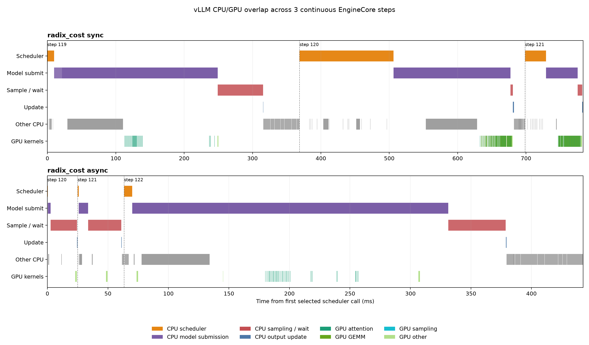
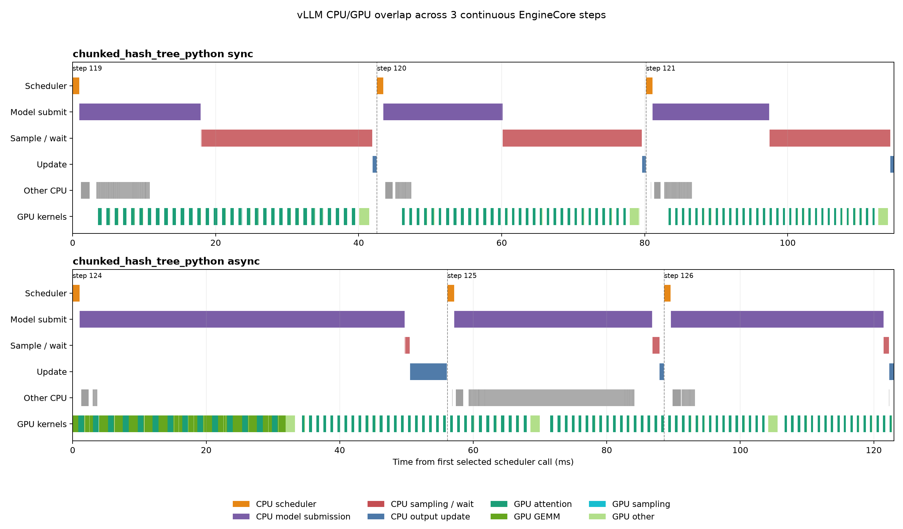
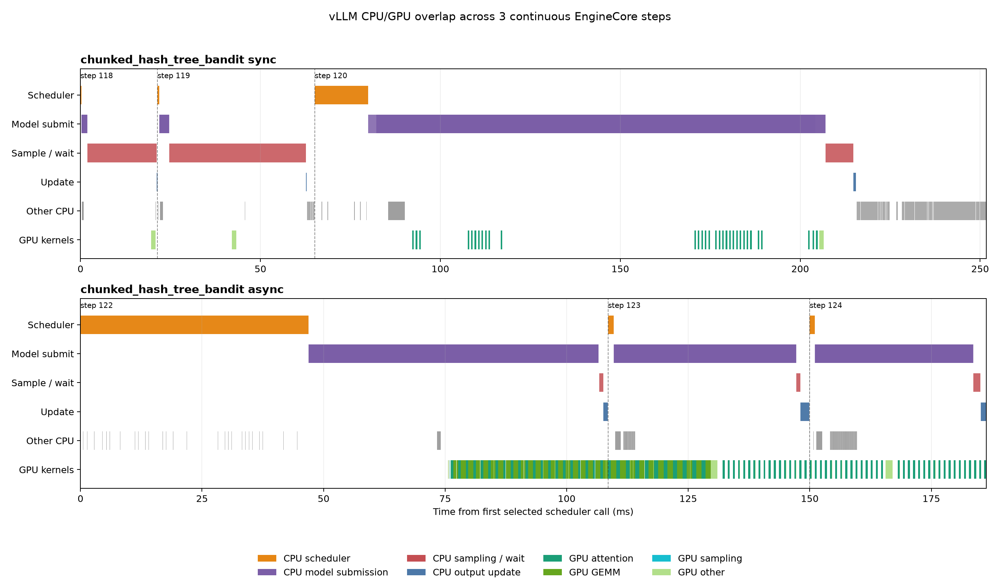

# vLLM CPU and Python Overhead Investigation

## Objective

Identify where wall-clock time goes in vLLM serving for a 10K-token
shared-prefix workload, distinguish CPU/frontend overhead from GPU execution,
measure whether asynchronous execution hides heavier request-policy work, and
identify concrete optimization targets.

## Configuration

- vLLM 0.22.1 on an NVIDIA RTX 6000 Ada Generation
- `meta-llama/Llama-3.1-8B`, float16, FlashAttention
- 10,000-token shared prefix + 20 unique input tokens
- 50 generated tokens per request
- 300 requests, maximum concurrency and `max_num_seqs` 100
- FCFS scheduling with prefix caching
- one authoritative timing-only async trial and one sync trial
- separate profiler-isolation trials with NSYS at 500 Hz and/or a 60-second
  py-spy subprocess capture with native frames

The primary CPU measurements below come from the latest timing-only rerun.
Profiler-enabled trials are retained only to quantify measurement distortion;
their timings are not used as production estimates.

## Experiment status

| Experiment                    | Status                        | Result                                                                                                                       |
| ----------------------------- | ----------------------------- | ---------------------------------------------------------------------------------------------------------------------------- |
| Authoritative CPU drilldown   | Success                       | Latest timing-only sync/async pair measured every exclusive EngineCore region without py-spy or NSYS                         |
| Profiler-isolation validation | Success                       | Timing-only, py-spy-only, NSYS-only, and py-spy+NSYS pairs identified py-spy as the dominant source of timing distortion     |
| GPU timing                    | Success after NSYS workaround | NSYS captured 17K+ kernels per mode; CUDA events supplied per-call GPU duration after NSYS's child-process projection failed |
| Online versus offline         | Success after retry           | Initial FlashInfer sampler JIT failed; rerun with `VLLM_USE_FLASHINFER_SAMPLER=0` completed                                  |
| Torch-profiler window         | Success after retry           | The old profiler environment variable produced no trace; `--profiler-config` generated a 30.8 MB trace and summary           |
| Fresh GPU-busy analysis       | Success after correction      | Two fresh NSYS traces analyzed; GR-active extraction was corrected to exclude cycle-count metrics                            |
| Heavy-policy async follow-up  | Success                       | 24 clean trials covered four policies and both scheduling modes; separate NSYS runs produced three continuous-step timelines |

## Authoritative timing-only serving results

| Mode  | Output throughput (tok/s) | Duration (s) | Mean TTFT (ms) | Mean TPOT (ms) |
| ----- | ------------------------: | -----------: | -------------: | -------------: |
| Sync  |                    694.60 |        21.60 |       2,018.20 |         100.62 |
| Async |                    710.32 |        21.12 |       2,007.75 |          98.19 |

Async throughput was 2.26% higher, with slightly lower TTFT and TPOT. These are
the serving results used for the CPU phase budget below.

## Per-iteration EngineCore budget

Exclusive timing regions inside `EngineCore.step` and
`EngineCore.step_with_batch_queue` resolve the code previously hidden by
subtraction-based accounting.

| Exclusive EngineCore phase                          | Sync ms/step |    Sync % | Async ms/step |   Async % |
| --------------------------------------------------- | -----------: | --------: | ------------: | --------: |
| Scheduler                                           |         1.83 |      1.79 |          2.23 |      2.27 |
| Execute-model submission                            |         7.32 |      7.17 |          8.23 |      8.37 |
| Sync `sample_tokens` (actual GPU work)              |        92.98 |     91.01 |             — |         — |
| Async initial sample submission                     |            — |         — |          6.76 |      6.88 |
| Async model/sample future wait                      |            — |         — |         82.50 |     83.96 |
| Update from output                                  |         0.42 |      0.41 |          0.50 |      0.51 |
| Request checks, grammar, queues, and abort handling |         0.01 |      0.01 |          0.01 |      0.01 |
| Timer reconciliation error                          |        -0.39 |     -0.38 |         -1.97 |     -2.01 |
| **EngineCore step**                                 |   **102.16** | **100.0** |     **98.26** | **100.0** |

The sync remainder is overwhelmingly the fallback call to
`model_executor.sample_tokens()` after `execute_model()` returns `None`. In the
async batch-queue path, the corresponding cost appears mainly in
`future.result()`, with smaller launch-side costs for model and sample
submission. The small negative reconciliation row is timing/context-manager
instrumentation overhead, not another execution phase.

The sync path spends 91% of its step in fallback sampling. The async path
spends 84% waiting for the queued model/sample future and another 6.9%
submitting sampling. Scheduler bookkeeping is approximately 2% in both modes.

A profiler-isolation check validated the choice of the timing-only result.
NSYS-only scheduler timing stayed close at 2.11 ms sync and 1.91 ms async.
Attaching py-spy increased the apparent scheduler time by 4.0-4.8x, reduced
throughput by 56-57%, fragmented 200 iterations into 400-500 calls, and fell
20-28 seconds behind. All py-spy timing values are therefore excluded from the
reported CPU budget rather than presented as an alternative measurement.

Frontend output processing is in a separate process and can overlap EngineCore,
so it is not additive with the table:

| Frontend function                                    |                 Sync |                Async |
| ---------------------------------------------------- | -------------------: | -------------------: |
| `OutputProcessor.process_outputs` per call           | 15.59 ms (240 calls) | 14.95 ms (239 calls) |
| Output-processing total                              |               3.74 s |               3.57 s |
| `BaseIncrementalDetokenizer.update` per token update |              0.21 ms |              0.20 ms |
| Detokenization total, 15,400 calls                   |               3.27 s |               3.09 s |

Detokenization consumed almost as much cumulative time as the complete output
processor. The totals are cumulative function times and may overlap across
threads/processes; they should not be summed with EngineCore wall time.

## Heavy-policy async and CPU/GPU timeline follow-up

This follow-up repeated the same 10K-prefix, 20-token suffix, 50-token output,
300-request, concurrency-100 workload with request policies that perform more
work than FCFS. The policy-enabled environment uses vLLM 0.14.0 because the
vendored radix-cost and chunked-hash-tree integrations target that version.
FCFS was rerun in the same environment as the control. These absolute numbers
must not be compared directly with the vLLM 0.22.1 baseline above.

Each policy/mode combination had three clean trials with seeds 0-2 and
alternating execution order. Cumulative CPU timing was enabled, while py-spy,
NSYS, CUDA events, and GPU metrics were absent. Separate diagnostic NSYS runs
then captured CPU NVTX ranges and CUDA kernels for one sync and one async trace
per heavy policy. The NSYS traces do not contribute to the clean throughput or
CPU timing estimates.

### Clean paired serving results

| Policy | Sync throughput (tok/s) | Async throughput (tok/s) | Async change | Sync TTFT (ms) | Async TTFT (ms) | Sync TPOT (ms) | Async TPOT (ms) |
| --- | ---: | ---: | ---: | ---: | ---: | ---: | ---: |
| FCFS | 1,652.50 ± 20.22 | 1,689.54 ± 23.21 | +2.24% | 1,298.40 | 1,334.64 | 34.21 | 32.18 |
| Radix cost | 1,622.50 ± 32.74 | 1,683.92 ± 17.90 | +3.79% | 1,365.24 | 1,345.94 | 34.13 | 32.19 |
| Python chunked hash tree | 1,537.91 ± 40.48 | 1,582.81 ± 51.47 | +2.92% | 1,532.89 | 1,527.57 | 34.26 | 32.38 |
| Chunked-hash-tree bandit | 1,654.94 ± 45.77 | 1,714.15 ± 2.99 | +3.58% | 1,288.61 | 1,313.17 | 34.48 | 31.85 |

Async throughput was higher in all 12 individual pairs, not only in the four
means. The gains ranged from 2.24% to 3.79%. TPOT improved by 5.49-7.62%, while
TTFT moved in both directions: it improved slightly for radix cost and Python
CHT, but regressed for FCFS and the bandit. This is consistent with async
execution improving steady-state token cadence without guaranteeing lower
first-token latency.

### Per-iteration EngineCore budgets by scheduler

The following tables apply the same exclusive phase accounting as the baseline
budget above to each policy in the vLLM 0.14.0 follow-up. Values are means of
the three clean timing-only trials. Percentages are relative to the mean
EngineCore step for that policy and mode. These are CPU wall-time regions;
`sample_tokens` and future waits can enclose or wait for GPU work, but they are
not CUDA-event durations.

#### FCFS control

| Exclusive EngineCore phase                          | Sync ms/step | Sync % | Async ms/step | Async % |
| --------------------------------------------------- | -----------: | -----: | ------------: | ------: |
| Scheduler                                           |         2.13 |   4.52 |          2.87 |    6.51 |
| Execute-model submission                            |        14.67 |  31.08 |         28.29 |   64.09 |
| Sync fallback `sample_tokens`                       |        29.82 |  63.17 |             — |       — |
| Async initial sample submission                     |            — |      — |          0.82 |    1.85 |
| Async model/sample future wait                      |            — |      — |         11.40 |   25.83 |
| Update from output                                  |         0.47 |   0.99 |          0.57 |    1.30 |
| Request checks, grammar, queues, and abort handling |         0.03 |   0.07 |          0.04 |    0.09 |
| Timer reconciliation error                          |         0.08 |   0.17 |          0.14 |    0.32 |
| **EngineCore step**                                 |   **47.21** | **100.0** |     **44.14** | **100.0** |

#### Radix cost

| Exclusive EngineCore phase                          | Sync ms/step | Sync % | Async ms/step | Async % |
| --------------------------------------------------- | -----------: | -----: | ------------: | ------: |
| Scheduler                                           |         2.66 |   5.59 |          2.75 |    6.42 |
| Execute-model submission                            |        13.75 |  28.94 |         27.68 |   64.53 |
| Sync fallback `sample_tokens`                       |        30.55 |  64.29 |             — |       — |
| Async initial sample submission                     |            — |      — |          0.90 |    2.10 |
| Async model/sample future wait                      |            — |      — |         10.74 |   25.04 |
| Update from output                                  |         0.45 |   0.95 |          0.63 |    1.48 |
| Request checks, grammar, queues, and abort handling |         0.03 |   0.07 |          0.04 |    0.10 |
| Timer reconciliation error                          |         0.07 |   0.16 |          0.15 |    0.34 |
| **EngineCore step**                                 |   **47.52** | **100.0** |     **42.89** | **100.0** |

#### Python chunked hash tree

| Exclusive EngineCore phase                          | Sync ms/step | Sync % | Async ms/step | Async % |
| --------------------------------------------------- | -----------: | -----: | ------------: | ------: |
| Scheduler                                           |         1.98 |   4.25 |          1.95 |    4.82 |
| Execute-model submission                            |        11.92 |  25.58 |         26.06 |   64.55 |
| Sync fallback `sample_tokens`                       |        32.06 |  68.79 |             — |       — |
| Async initial sample submission                     |            — |      — |          0.74 |    1.84 |
| Async model/sample future wait                      |            — |      — |         10.72 |   26.56 |
| Update from output                                  |         0.54 |   1.15 |          0.72 |    1.80 |
| Request checks, grammar, queues, and abort handling |         0.03 |   0.06 |          0.04 |    0.10 |
| Timer reconciliation error                          |         0.07 |   0.15 |          0.14 |    0.34 |
| **EngineCore step**                                 |   **46.61** | **100.0** |     **40.37** | **100.0** |

#### Chunked-hash-tree bandit

| Exclusive EngineCore phase                          | Sync ms/step | Sync % | Async ms/step | Async % |
| --------------------------------------------------- | -----------: | -----: | ------------: | ------: |
| Scheduler                                           |         2.06 |   4.39 |          2.59 |    6.07 |
| Execute-model submission                            |        14.22 |  30.26 |         27.36 |   63.99 |
| Sync fallback `sample_tokens`                       |        30.10 |  64.05 |             — |       — |
| Async initial sample submission                     |            — |      — |          0.80 |    1.87 |
| Async model/sample future wait                      |            — |      — |         11.23 |   26.28 |
| Update from output                                  |         0.49 |   1.05 |          0.59 |    1.38 |
| Request checks, grammar, queues, and abort handling |         0.03 |   0.07 |          0.04 |    0.08 |
| Timer reconciliation error                          |         0.08 |   0.17 |          0.14 |    0.33 |
| **EngineCore step**                                 |   **47.00** | **100.0** |     **42.75** | **100.0** |

Across all four policies, async reduced the mean EngineCore step by 3.07-6.24
ms. The accounting location shifted from the sync fallback `sample_tokens`
region to asynchronous model submission plus future completion. Scheduler time
remained 1.95-2.87 ms/step and represented 4.25-6.51% of these shorter vLLM
0.14.0 steps.

### Where the additional policy work appears

The complete `Scheduler.schedule()` call did not become uniformly more
expensive. Much of the deliberately heavier tree work occurs when requests are
admitted through `add_request()`, outside the top-level schedule call:

| Policy | Sync `schedule` (ms/call) | Async `schedule` (ms/call) | Sync admission (ms/request) | Async admission (ms/request) |
| --- | ---: | ---: | ---: | ---: |
| FCFS | 2.13 | 2.90 | — | — |
| Radix cost | 2.65 | 2.78 | 0.86 | 1.16 |
| Python chunked hash tree | 1.98 | 1.96 | 3.96 | 5.27 |
| Chunked-hash-tree bandit | 2.06 | 2.62 | 0.47 | 0.51 |

The Python CHT has the clearest heavy CPU path: hashing and inserting one 10K
prompt took 3.96-5.27 ms per request, approximately an order of magnitude more
than the native CHT admission path. Its `find_best_request()` lookup remained
only 1.12-1.37 microseconds per call. The top-level schedule values should not
be read as a policy-only microbenchmark because each policy changes batch
composition and the number of schedule calls.

### Continuous CPU/GPU timelines

Each plot uses three consecutive EngineCore steps centered in its respective
trace. CPU ranges and GPU kernels share the NSYS clock, so direct intersection
between the orange scheduler ranges and the GPU-kernel lane measures observed
overlap. The `Model submit` lane contains both the EngineCore submission range
and the CPU-side `GPUModelRunner.execute_model` wrapper; only the bottom kernel
lane is GPU execution. Inclusive `EngineCore.step` and
`EngineCore.step_with_batch_queue` ranges are used only for step boundaries and
are excluded from the `Other CPU` lane; the remaining grey bars are unmatched
instrumented operations rather than a residual or an exclusive-time total.

| Policy | Sync window (ms) | Async window (ms) | Sync scheduler (ms) | Async scheduler (ms) | Sync scheduler/GPU overlap | Async scheduler/GPU overlap | Sync GPU active | Async GPU active |
| --- | ---: | ---: | ---: | ---: | ---: | ---: | ---: | ---: |
| Radix cost | 783.55 | 442.68 | 177.62 | 8.01 | 0.00% | 0.00% | 10.84% | 2.77% |
| Python chunked hash tree | 114.86 | 123.02 | 2.70 | 3.04 | 0.00% | 60.59% | 36.50% | 56.11% |
| Chunked-hash-tree bandit | 251.70 | 186.30 | 15.54 | 49.16 | 0.00% | 3.26% | 6.89% | 41.15% |

The sync snapshots show no scheduler/kernel overlap, as expected for the
serial path. The Python-CHT async snapshot directly demonstrates the intended
pipeline: 60.59% of scheduler time overlaps CUDA kernels, and GPU-active time
rises from 36.50% to 56.11% within the selected window. The bandit async window
shows a smaller 3.26% direct intersection despite much higher GPU activity.
The selected radix window shows none.

These three-step windows are diagnostic snapshots, not aggregate overlap
estimates. They were centered independently in each trace, have different
batch composition, and in the radix and bandit cases include expensive
outlier calls. The lack of overlap in one radix window does not contradict its
repeatable 3.79% throughput improvement; async can also reduce bubbles in
other iterations or overlap future completion and request processing outside
the selected three steps.

## GPU activity and idle time

The corrected fresh NSYS analysis used `GR Active [Throughput %]` as the busy
proxy and excluded `GR Active [Cycles Active]`.

| Mode  | GR active mean % | SM active mean % | Median % | Samples below 10% | Samples above 80% | DRAM mean % |
| ----- | ---------------: | ---------------: | -------: | ----------------: | ----------------: | ----------: |
| Sync  |            24.44 |            22.11 |        0 |            74.21% |            23.37% |        5.78 |
| Async |            27.54 |            24.58 |        0 |            71.70% |            26.95% |        5.67 |

The GPU was below 10% activity in roughly 72-74% of the active DRAM window.
Async increased mean GR activity by 3.10 percentage points, but did not increase
instrumented throughput materially. The workload is bursty and GPU-idle
dominated at this measurement boundary, not continuously memory-bandwidth-bound.

### Follow-up: CPU submission time versus GPU execution time

Separate NSYS runs completed at 712.96 tok/s sync and 740.20 tok/s async and
captured 17,508 and 17,407 kernels, respectively. The intended NSYS NVTX GPU
projection could not be used: NSYS 2026.1 recorded the EngineCore child
process's CUDA timestamps in a different time origin from its NVTX timestamps,
so NVIDIA's `nvtx_gpu_proj_sum` report returned no range rows despite both the
ranges and kernels being present in SQLite.

The confirmation pass therefore retained the same NVTX method boundaries and
placed CUDA events on the model runner's stream around
`GPUModelRunner.execute_model` and `_prepare_inputs`. It completed at 714.93
tok/s sync and 741.27 tok/s async.

NSYS therefore confirmed that the workload executed and supplied kernel-level
traces and summaries, but it did **not** independently confirm the duration of
the model method. The GPU method-duration numbers below are CUDA-event results,
not NSYS NVTX-projection results.

| Timing boundary                                          | Sync ms/call | Async ms/call |
| -------------------------------------------------------- | -----------: | ------------: |
| Authoritative CPU `execute_model`, including preparation |         7.25 |          8.16 |
| Authoritative CPU input preparation                      |         1.55 |          2.17 |
| **Authoritative CPU execute, excluding preparation**     |     **5.70** |      **5.99** |
| CUDA-event model range, including preparation            |        90.41 |         83.04 |
| CUDA-event preparation, normalized per model call        |         0.89 |          0.49 |
| **CUDA-event model range, excluding preparation**        |    **89.52** |     **82.56** |

The CPU `execute_model` number is therefore not GPU execution time. It is a
host-side cumulative function timer around asynchronous CUDA submission. The
GPU remains active after the Python call returns, which explains why the CUDA
event duration is much larger. The CPU and CUDA-event values come from separate
clean runs because adding CUDA events changes synchronization behavior; neither
CPU launch timer is a direct measurement of kernel execution duration.

The CUDA-event model duration does match the complete CPU-observed EngineCore
step in the same event-instrumented run:

| Mode  | CUDA-event model range, including preparation | CPU EngineCore step | Absolute difference | Difference versus step |
| ----- | --------------------------------------------: | ------------------: | ------------------: | ---------------------: |
| Sync  |                                      90.41 ms |            94.98 ms |             4.57 ms |                   4.8% |
| Async |                                      83.04 ms |            83.43 ms |             0.39 ms |                   0.5% |

This agreement resolves the apparent CPU/GPU mismatch. The CPU
`execute_model` wrapper measures only asynchronous launch work. Sync then waits
mainly in fallback `sample_tokens()`, while async waits mainly in
`future.result()`. Once those completion waits are included, the full CPU step
tracks GPU elapsed time closely. A direct EngineCore-worker NSYS capture is
still required for an independent NSYS range-duration validation.

## Online versus offline throughput

The offline benchmark reported:

| Mode  | Offline output throughput (tok/s) | Offline requests/s |
| ----- | --------------------------------: | -----------------: |
| Sync  |                            810.85 |              16.22 |
| Async |                            736.86 |              14.74 |

The online FlashAttention run omitted CPU timing and py-spy while retaining
NSYS GPU metrics, and used the same model and 300-request workload:

| Mode  | Offline (tok/s) | Online (tok/s) | Online shortfall vs offline |
| ----- | --------------: | -------------: | --------------------------: |
| Sync  |          810.85 |         574.15 |                       29.2% |
| Async |          736.86 |         607.71 |                       17.5% |

This shortfall bounds the combined online-serving cost: HTTP/OpenAI frontend,
streaming output handling, detokenization, serialization, and differences
between the offline and online engine paths. It is not attributable solely to
HTTP.

## Torch-profiler micro-window

The corrected torch profiler recorded five active sync iterations:

- self CPU time: 2.077 s;
- self CUDA time: 1.639 s, or about 328 ms per profiled step;
- `cudaEventSynchronize`: 1.471 s and 70.82% of self CPU time;
- matrix multiplication kernels: 1.230 s and 75.06% of self CUDA time; and
- FlashAttention split-KV kernels: 352.83 ms and 21.53% of self CUDA time.

Most measured CPU time in this micro-window was waiting for the GPU, while CUDA
time was dominated by GEMMs and then attention. The profiler reduced benchmark
throughput to 207 tok/s, so its timing is diagnostic rather than representative.

## Where the time goes

1. **Model-output completion dominates EngineCore time.** Sync spends 92.98
   ms/step in fallback sampling; async spends 82.50 ms/step waiting for the
   queued model/sample future and 6.76 ms submitting sampling.
2. **Frontend output processing remains material but overlaps EngineCore.** It
   accumulated 3.57-3.74 seconds, of which detokenizer updates accumulated
   3.09-3.27 seconds.
3. **Scheduler bookkeeping is small in the authoritative run.** It measured
   1.83 ms sync and 2.23 ms async, or approximately 2% of EngineCore time.
   Profiler isolation showed that NSYS alone remains near this result, whereas
   py-spy makes wall-clock function timings unusable.
4. **The CPU execute timer is launch time, not GPU duration.** CUDA events
   measured 89.52 ms sync and 82.56 ms async excluding input preparation,
   versus 5.70 ms and 5.99 ms in the authoritative CPU timer. In the same
   event-instrumented run, the GPU range was within 4.8% sync and 0.5% async of
   the complete EngineCore step.
5. **The serving pipeline leaves substantial GPU gaps.** Roughly 72-74% of
   samples were below 10% GR activity, despite individual bursts reaching full
   activity. The low wall-clock DRAM mean is primarily dilution by idle gaps.
6. **Async helps consistently in the heavy-policy follow-up.** It improved all
   12 paired throughput comparisons by 2.24-3.79% in the vLLM 0.14 policy
   environment. The Python-CHT timeline directly shows scheduler/kernel
   overlap, but the other snapshots show that overlap varies by iteration and
   is not captured reliably by one short window.

## Optimization candidates

1. **Reduce output-path work:** batch token-ID conversion, avoid detokenizing
   intermediate tokens when the client accepts token IDs, reduce per-token
   allocation, and coalesce streaming/serialization work.
2. **Cache and batch prefix metadata:** reuse block hashes for the shared 10K
   prefix, reduce SHA-256 work and Python/NumPy packing, and move remaining
   per-request hashing or table construction into batched native code.
3. **Overlap CPU phases with GPU execution:** preserve async output processing,
   prepare the next batch while the current batch executes, and extend warmup to
   cover slot-mapping shapes so Triton JIT does not occur during inference.
4. **Optimize the sampling/completion path:** the detailed step regions show
   that synchronous fallback sampling and asynchronous future completion, not
   scheduler bookkeeping, dominate EngineCore wall time in the authoritative
   run.
5. **Keep profilers separated:** collect CPU timing independently. If py-spy is
   needed for qualitative hotspot discovery, use a lower 10-20 Hz rate in a
   separate run. Use CUDA events or a server-rooted NSYS launch for GPU method
   duration.
6. **Reset and summarize timers after warmup:** report median and p95 in
   addition to mean, and repeat timing-only trials before assigning a precise
   production scheduler cost.

## Limitations

- The original CPU/GPU drilldowns have one repetition and fixed mode order.
  The heavy-policy follow-up has three paired repetitions with alternating
  order, but still does not establish a tight confidence interval.
- Function timers are cumulative and include nested calls; only the adjusted
  core table avoids known double counting.
- Frontend and EngineCore process totals overlap in wall-clock time.
- py-spy's sampling backlog limits precise self-time attribution.
- The torch-profiler run captures five iterations under heavy profiler overhead.
- Offline versus online is a subsystem bound, not a pure HTTP measurement.
- The authoritative CPU and CUDA-event values come from separate runs. Their
  serving throughputs are in the same general range, but they are still single
  trials and CUDA-event instrumentation changes synchronization behavior.
- The profiler-isolation matrix also has one trial per condition. It establishes
  the source of the large profiler-dependent discrepancy but not a tight
  confidence interval for clean timings.
- Cumulative timing begins before the eight-request warmup, and only aggregate
  mean/min/max are retained. Warmup variation and a few expensive calls can
  move the reported mean.
- CUDA events measure elapsed work on the instrumented stream. They do not
  replace a multi-stream critical-path analysis.
- NSYS raw CUDA traces are valid, but its built-in NVTX GPU projection was not
  usable for the multiprocess child-worker capture because of timestamp-origin
  mismatch. Consequently, the reported GPU method duration is CUDA-event
  validated, not independently NSYS-range validated.
- Heavy-policy results use vLLM 0.14.0 and cannot be compared absolutely with
  the vLLM 0.22.1 baseline. Each policy timeline is one NSYS trace and only
  three independently centered steps; its overlap percentage is a local
  example, not a workload-wide mean.

## Artifacts

- Offline A/B: `results/vllm_offline_ab_10k_retry/`
- Torch profiler: `results/vllm_torch_profile_10k_retry2/`
- Corrected GPU activity: `results/gpu_busy_analysis_fresh/`
- GPU timing follow-up and same-run CUDA-event step data:
  `results/vllm_cpu_overhead_drilldown_20260809/`
- Authoritative CPU timing and profiler-isolation validation:
  `results/vllm_scheduler_profiler_matrix_20260811/`
- Consolidated profiler-matrix CSV:
  `results/vllm_scheduler_profiler_matrix_20260811/profiler_matrix_summary.csv`
- Heavy-policy clean trials, timing summaries, timeline event CSVs, and plots:
  `results/vllm_heavy_scheduler_overlap_20260816/`
- Raw NSYS reports remain in the corresponding remote results directory.
