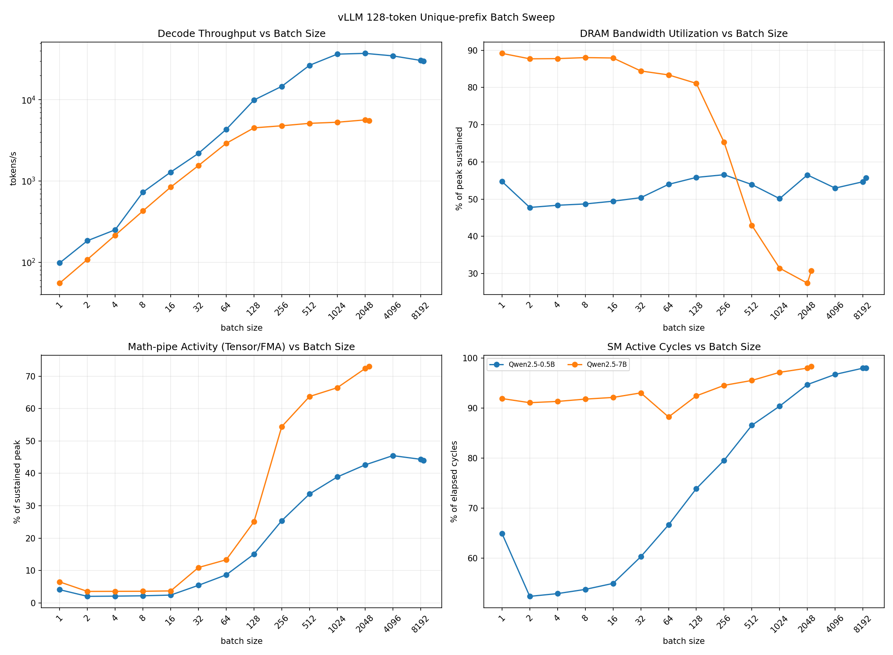
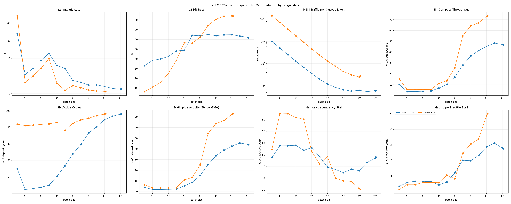
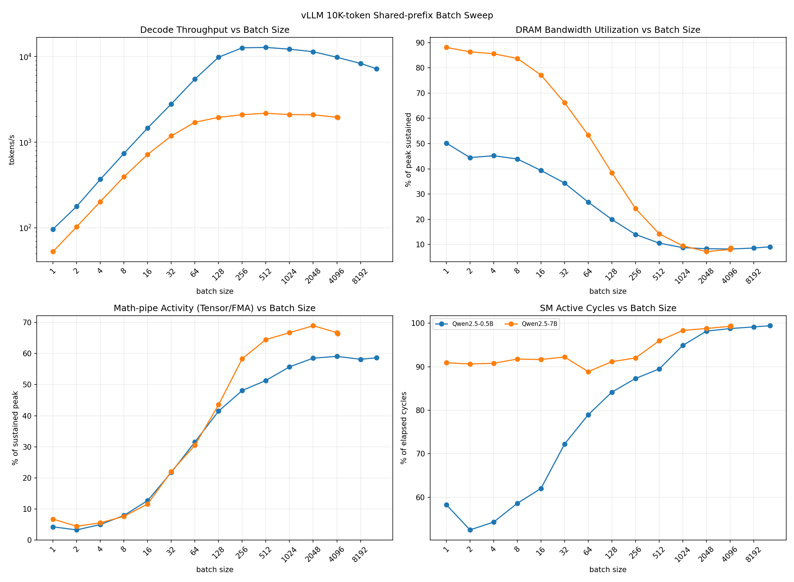
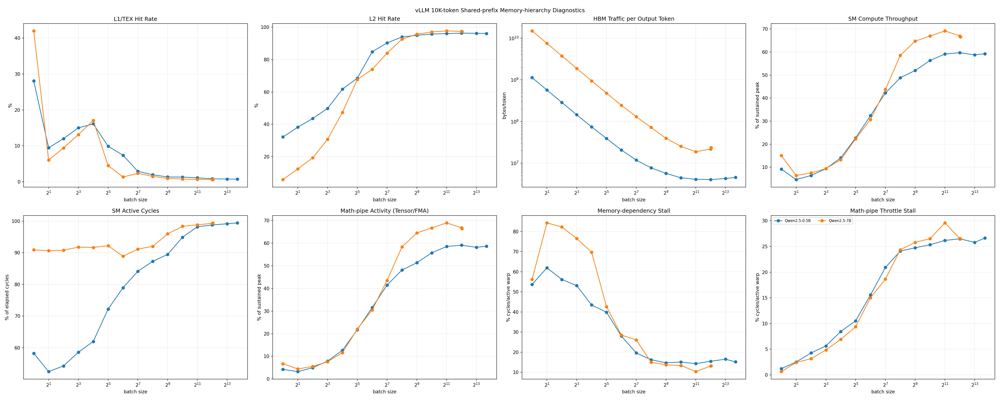
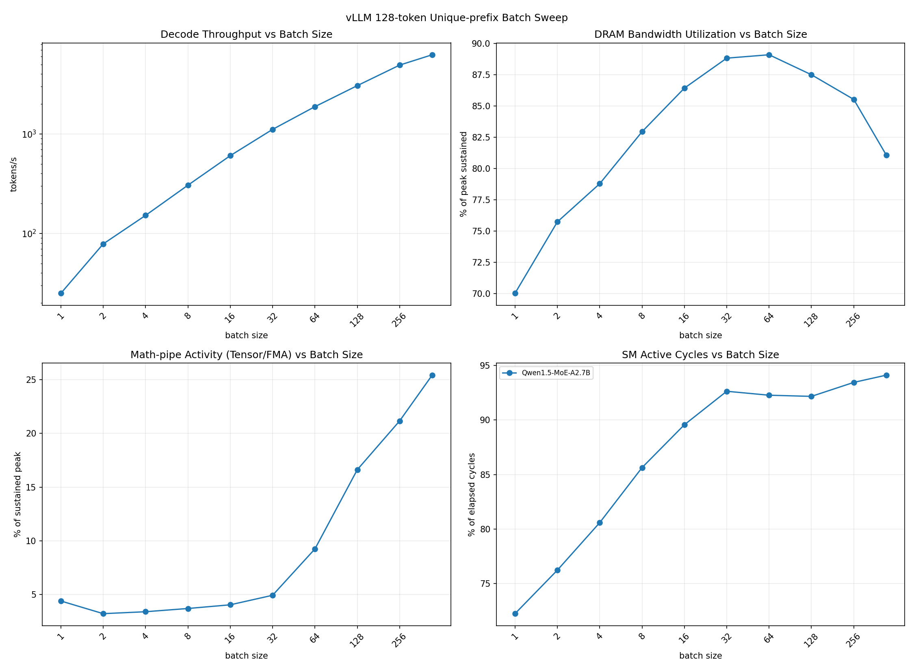
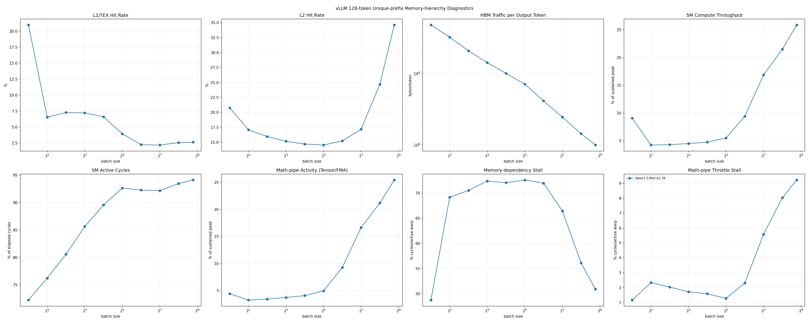
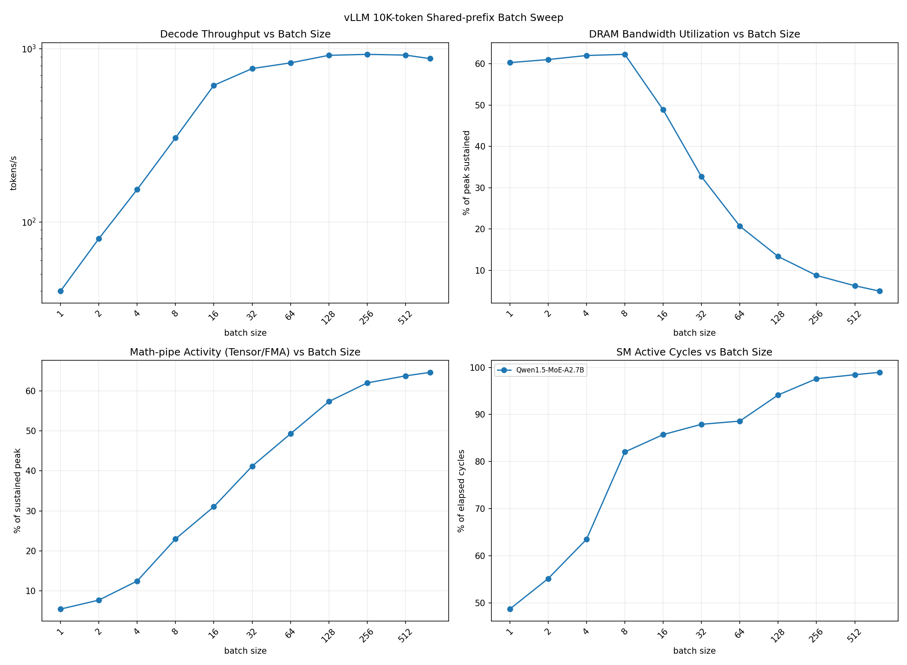
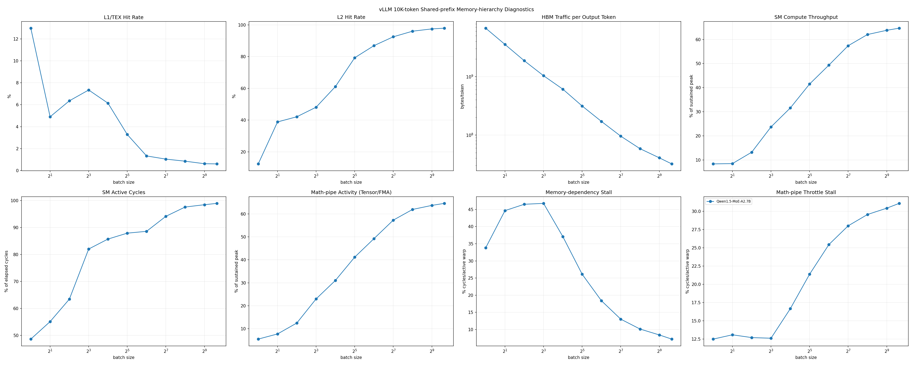

# vLLM resident decode batch saturation

## Scope and status

This study repeats the batch-size and memory-hierarchy measurements in
[the component study](component_saturation_study.md) using complete vLLM models.
The target is hinton-01's NVIDIA RTX 6000 Ada Generation (48 GB). The engine uses
95% of device memory, leaving 5% for runtime headroom. This GPU has GDDR6 device
memory; the DRAM counters below describe device-memory traffic.

The dense and mixture-of-experts (MoE) sweeps have completed. All 78 planned
Nsight Compute points succeeded.

| Model | Role | FP16 weight storage | Architecture |
| --- | --- | ---: | --- |
| Qwen/Qwen2.5-0.5B-Instruct | Very small dense model | approximately 1 GB | 0.5B dense |
| Qwen/Qwen2.5-7B-Instruct | Medium dense model | approximately 15.2 GB | 7B dense |
| Qwen/Qwen1.5-MoE-A2.7B-Chat | Medium MoE model | 26.67 GiB measured | 14.3B total, 2.7B active; 60 experts, top 4 |

The dense models use the same architecture family. The MoE model activates four
of its 60 experts per token. All three support the 10K context without RoPE
overrides. Their configurations are available from the publisher:
[0.5B](https://huggingface.co/Qwen/Qwen2.5-0.5B-Instruct/blob/main/config.json) and
[7B](https://huggingface.co/Qwen/Qwen2.5-7B-Instruct/blob/main/config.json), and
[MoE-A2.7B](https://huggingface.co/Qwen/Qwen1.5-MoE-A2.7B-Chat/blob/main/config.json).

## Workloads and controls

- **128 unique:** exactly 128 input token IDs per request. Requests have distinct
  first blocks and prefix caching is disabled. Physical KV block IDs are checked
  for disjointness.
- **10K shared:** exactly 10,000 identical input token IDs followed by 20 distinct
  request-specific tokens. The shared prefix is prefetched once. Prefix caching
  is enabled, and the 625 complete 16-token prefix blocks must have identical
  physical IDs across every resident request.
- Stock vLLM 0.22.1, single GPU, FP16 weights and KV cache, synchronous scheduling,
  eager execution, and the default compatible attention backend. Engine
  configuration and GPU identity are saved in every successful point.
- vLLM selected its Triton unquantized MoE backend for Qwen1.5-MoE-A2.7B. No
  RTX 6000 Ada tuning file was available for its 60-expert shape, so vLLM used
  the default MoE kernel configuration.
- No CPU weight offload, no swap space, and no KV transfer/offload connector.
  CPU scheduler metadata and normal model loading are permitted; weights and
  active KV state execute on the GPU.
- Each point starts a fresh engine. Batch sizes double from one until an actual
  CUDA OOM, scheduler preemption, or a reproducible vLLM/CUDA runtime ceiling;
  binary refinement locates the boundary to one request. Memory and runtime
  boundaries are labeled separately. Other configuration and profiler failures
  stop the run as errors.
- `max_num_seqs` equals the tested batch; the token budget is at least the batch
  size. Every timed step must schedule exactly one decode token for every request.
  Queuing/preemption cannot silently convert a large requested batch into a
  smaller measured batch.
- Prompt prefill and admission are excluded. After reaching a full decode batch,
  five warmup steps precede 64 synchronized timed decode steps. Greedy decoding
  ignores EOS so requests stay active. Throughput includes CPU scheduling and
  sampling within each engine step, but excludes HTTP/client overhead.
- Chunked prefill can let early requests decode before the full batch is admitted.
  Each point records the minimum and maximum context at the measurement start;
  these must be considered when comparing batch sizes. The 128/10K names refer to
  input lengths, not a fixed KV length throughout autoregressive decoding.

Eager execution makes the decode kernels accessible to Nsight Compute and aligns
with the isolated component study. This is not a claim about peak production
serving performance with CUDA graphs or asynchronous scheduling.

## Counters and analysis

An independent Nsight Compute kernel-replay run repeats each successful doubling
point and the exact resident endpoint with identical warmup and decode settings.
Binary-search refinement points are used only to locate the endpoint. The
profiler run's KV reservation is reduced to the active blocks observed in the
timing run plus one growth block per request (at least 16,384 tokens of total
capacity). This prevents kernel replay from backing up tens of GiB of unused
cache. vLLM's synthetic startup sampler warmup is capped at 1,024 dummy requests
because its full vocabulary-logit allocation otherwise exhausts memory under
NCU before KV initialization. The actual measured decode retains the full tested
batch. Active prompt/KV contents and request counts are unchanged, but allocation
sizes and addresses can differ. Only the unprofiled full-budget runs establish
the resident memory limit. The profiler executes and captures one measured decode
step after the same five warmup steps. Profiler timings never enter the throughput
series.

Metrics match the component memory-hierarchy pass: DRAM throughput and read/write
sectors, L1/TEX and L2 hit rates, L2 hit/miss sectors, composite SM throughput,
active SM cycles, occupancy, instruction issue, tensor/FMA activity, and memory
and math-pipe stall reasons. Percentages are weighted by captured kernel duration;
sector counts are summed. DRAM bytes per output token are 32 times the total DRAM
sectors divided by the actual decode batch. Math-pipe activity is the weighted
per-kernel maximum of tensor and FMA activity. Missing counters are errors, not zero.

The endpoint is specific to this engine configuration, prompt shape, and output
horizon. A throughput-only endpoint can exceed the profiler's memory capacity;
that must be reported as a missing NCU measurement rather than moving the boundary.
An optional `--max-batch` exists only for smoke tests and is labeled `user_cap`.

## Reproduction

Run on a GPU host with vLLM 0.22.1, Nsight Compute permissions, and model weights
available. The wrapper supports the usual remote and tmux options:

```bash
VLLM_SATURATION_VENV=/home/geet/code/attention-bw/.venv \
TMUX_SESSION=vllm_saturation \
scripts/vllm-server.sh saturation --remote --detach \
  --host hinton-01 --remote-dir /home/geet/code/vllm-saturation-study \
  --out results/vllm_saturation_20260908
```

`VLLM_SATURATION_VENV` optionally reuses an existing GPU environment without
modifying its packages. Without it, the wrapper uses the target checkout's
`.venv`. All analysis and plot generation run remotely. Rerunning the same command
resumes completed points; settings must match the saved manifest.

```bash
scripts/vllm-server.sh fetch --host hinton-01 \
  --remote-dir /home/geet/code/vllm-saturation-study \
  --out results/vllm_saturation_20260908
```

The MoE sweep uses the same controls and adds an explicit model selection:

```bash
VLLM_SATURATION_VENV=/home/geet/code/attention-bw/.venv \
TMUX_SESSION=vllm_moe_saturation \
scripts/vllm-server.sh saturation --remote --detach \
  --host hinton-01 --remote-dir /home/geet/code/vllm-saturation-study \
  --out results/vllm_moe_saturation_20260913 -- \
  --models Qwen/Qwen1.5-MoE-A2.7B-Chat
```

Outputs include `manifest.json`, per-point JSON and logs, per-point NCU CSVs,
per-workload `boundary.json`, combined `summary.csv`, `saturation_summary.csv`,
and separate batch-sweep and memory-hierarchy figures for each workload. Dense
artifacts are under `results/vllm_saturation_20260908`; MoE artifacts are under
`results/vllm_moe_saturation_20260913`. The final figures are tracked in
`docs/assets/`.

## Measured results

Saturation is the first measured batch reaching 95% of observed peak throughput.

### Dense-model results

#### 128-token Unique-prefix Results





#### 10K-token Shared-prefix Results





### MoE-model results

Run artifacts: `results/vllm_moe_saturation_20260913`.

#### 128-token Unique-prefix Results





#### 10K-token Shared-prefix Results





The MoE model reaches 6,255.85 tokens/s at its 436-request unique-prefix
endpoint. Its unique-prefix kernels remain DRAM-heavy: weighted DRAM utilization
is 81.08% at the endpoint, while SM compute throughput is 25.86% and
memory-dependency stalls are 50.91% of cycles per active warp.

For the shared-prefix workload, throughput saturates at batch 128 and peaks at
batch 256. From batch 1 to the 799-request endpoint, L2 hit rate rises from
12.37% to 97.95%, DRAM traffic per output token falls from 6.75 GB to 32.04 MB,
and weighted SM compute throughput rises from 8.35% to 64.68%. At the endpoint,
math-pipe activity is 64.60% and math-pipe throttle stalls are 31.09%, showing
that the large shared-prefix batch shifts the captured kernel mix toward compute
and math-pipe pressure.

### Summary

| Model | Workload | Saturation batch | Peak batch | Peak tok/s | Largest resident batch | First infeasible batch | Limit | NCU points / timing points |
| --- | --- | ---: | ---: | ---: | ---: | ---: | --- | ---: |
| Qwen2.5-0.5B-Instruct | 10k_shared | 256 | 512 | 12,792.71 | 13131 | 13132 | memory_boundary | 15 / 21 |
| Qwen2.5-0.5B-Instruct | 128_unique | 1024 | 2048 | 37,352.13 | 8824 | 8825 | memory_boundary | 15 / 19 |
| Qwen2.5-7B-Instruct | 10k_shared | 256 | 512 | 2,179.25 | 4197 | 4198 | memory_boundary | 14 / 17 |
| Qwen2.5-7B-Instruct | 128_unique | 2048 | 2048 | 5,659.43 | 2257 | 2258 | memory_boundary | 13 / 16 |
| Qwen1.5-MoE-A2.7B-Chat | 10k_shared | 128 | 256 | 927.82 | 799 | 800 | memory_boundary | 11 / 16 |
| Qwen1.5-MoE-A2.7B-Chat | 128_unique | 384 | 436 | 6,255.85 | 436 | 437 | memory_boundary | 10 / 13 |

The NCU column counts the planned doubling points plus the exact resident
endpoint. Binary-search refinement points locate the memory boundary and are not
profiled. The CSVs contain context ranges and the full counter set for every
planned profiler batch.
